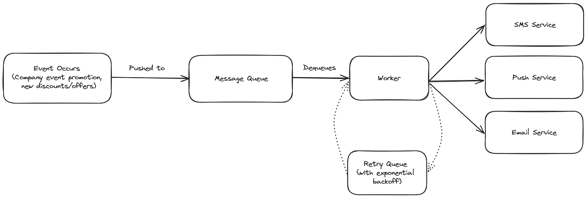

# Architecture

1. Some kind of event happens. For example: a company wants to advertise new offers/products or some discount rates (like in Zomato, Amazon).
2. The request to deliver notifications to each channel is queued on a message queue. Using **RabbitMQ** should suffice.
3. A worker dequeues the request from the queue, and makes the request to the API/service of each channel(SMS, e-mail, push, etc.)
4. In case of some failure, the request can be put on a retry queue so that requests don't fall through the cracks. The exponential backoff strategy would be used here for retrying the request calls.

